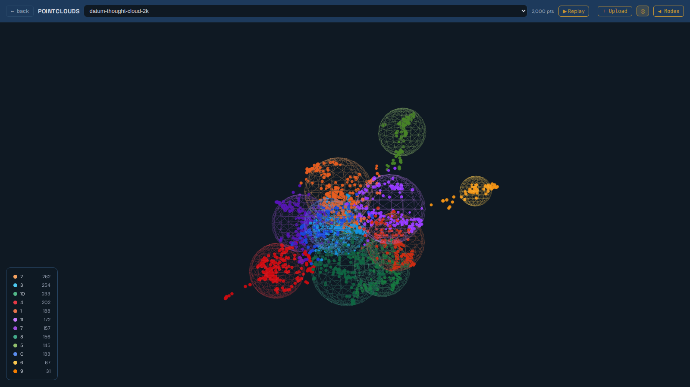
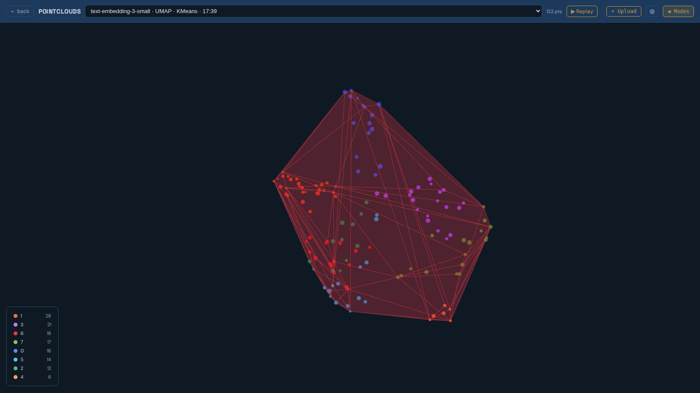

# Geometric Governance Pipeline

Hybrid retrieval for agent systems. Route queries in 1536-dimensional embedding space; reason about the answers in 3D.

This is the production sister of [Geometric-Semantic-Recursion-](https://github.com/mrodger/Geometric-Semantic-Recursion-); that repo focuses on the visualisation primitives, this one focuses on the pipeline that feeds them and the runtime that queries them.



## Why

Vector search gives you "the single best match for this query" and not much else. That is enough for chatbot prompts and stops being enough the moment you want to govern an agent, debug a corpus, or build a UI a human can read.

This pipeline keeps the 1536-dimensional embeddings where they matter (routing, true nearest-neighbour, fidelity to the model's training signal) and projects everything into a stable 3D map for the questions cosine similarity cannot answer cleanly. The result is a hybrid retrieval system that behaves like a vector DB when you want one and like a spatial database when you do not.

## What You Can Ask

Things that are easy in this pipeline and awkward in a plain vector store:

- **Near this idea but not an exact match.** A radius around the query's projected position, not its top-k. The radius means the same thing across corpora.
- **Between these two concepts.** Interpolate the midpoint of two queries in 3D and return everything in the band. Midpoint vectors in 1536D do not interpolate the way humans expect.
- **Where are the gaps in my corpus?** Empty regions of the 3D map are the things your dataset does not yet know about. In a vector store an empty region is invisible.
- **In-distribution, on the edge, or out?** The check endpoint returns IN / EDGE / OUT against the nearest cluster envelope.
- **Ranked by semantic position and one other attribute.** Recency, author, cost. One SQL query, not two scores you have to merge.
- **Where on the map did a query land?** A 3D dot any operator can read. Out-of-distribution queries are visibly out, not just numerically low.



## How It Works

Three dimensional regimes, used deliberately:

1. **1536D embedding space.** Where routing happens. Cosine similarity against per-cluster centroids picks the neighbourhood; KNN against per-item embeddings produces the candidate set. Nothing else preserves semantic fidelity this well.
2. **Global 3D map (PCA).** A linear projection of the whole corpus. Deterministic and stable: adding a new batch tomorrow does not rotate today's layout. Used for the overview UI and for cluster centroid positions.
3. **Local 3D maps (UMAP, per cluster).** A nonlinear projection fit on each cluster individually. UMAP preserves local manifold structure that PCA flattens, so distances inside the cluster mean something. Used for final-stage retrieval once a query has been routed.

PCA and UMAP are good at different jobs. PCA is honest about global variance and unstable about local neighbourhoods; UMAP is the opposite. Fit one globally, the other locally, and you get a stable overview without sacrificing fine retrieval.

In short: **1536D decides which neighbourhood; 3D decides what happens inside it.** Cosine is used once for routing, once for final disambiguation if needed; everything else runs in 3D.

### Performance

Single-query latency is sub-millisecond either way at this pipeline's scale: PostGIS KNN benchmarks land around 0.94 ms for GiST and 0.36 ms for SP-GiST ([Crunchy Data](https://www.crunchydata.com/blog/a-deep-dive-into-postgis-nearest-neighbor-search)); pgvector HNSW on 1536D vectors reports around 0.5 ms p95 ([Mastra](https://mastra.ai/blog/pgvector-perf), [ParadeDB](https://www.paradedb.com/learn/postgresql/tuning-pgvector)). The 3D win is footprint and scale: 24 bytes per row instead of ~6 KB, so more of the working set stays in cache, and the gap widens once vector indexes outgrow RAM ([Alibaba Cloud at billion-row scale](https://www.alibabacloud.com/blog/postgresql-nearest-neighbor-query-performance-on-billions-of-geolocation-records_597015)).

## Pipeline

```
ingest.py             embed text with text-embedding-3-small (1536D), cache to disk
build.py              global PCA -> points.geom; per-cluster UMAP -> local_xyz;
                      cache centroids in both 1536D and 3D
server.py             FastAPI: /search /check /route /route-multihop /local /clusters
governance_logger.py  fire-and-forget agent telemetry: sanitise -> route -> SQLite
```

## Endpoints

```
GET  /api/corpora
GET  /api/corpus/{slug}/clusters
POST /api/corpus/{slug}/search          KNN nearest items
POST /api/corpus/{slug}/check           IN / EDGE / OUT verdict
POST /api/corpus/{slug}/route           single best label
POST /api/corpus/{slug}/route-multihop  top-k unique labels
GET  /api/corpus/{slug}/local?category= per-cluster local map
```

## Quick Start

```
git clone https://github.com/mrodger/Geometric-governance-pipeline.git
cd Geometric-governance-pipeline

python -m venv .venv && source .venv/bin/activate
pip install -r requirements.txt

createdb pointcloud
psql pointcloud -f schema.sql

cp .env.example .env
# edit .env with your OPENAI_API_KEY and Postgres credentials
set -a; source .env; set +a

python ingest.py --corpus skills --input examples/skills.jsonl
python build.py  --corpus skills
uvicorn server:app --host 0.0.0.0 --port 8300

curl -s -X POST http://localhost:8300/api/corpus/skills/check \
  -H 'Content-Type: application/json' \
  -d '{"text":"how do I rename a function across the codebase"}'
```

## Governance Logger

`governance_logger.py` is a fire-and-forget wrapper around the routing endpoint. Use it from inside an agent:

```python
from governance_logger import log_user_message, log_tool_call, fire_and_forget

fire_and_forget(log_user_message(text, session_id=sid))
fire_and_forget(log_tool_call("Bash", {"command": cmd}, session_id=sid))
```

Three SQLite tables (`user_messages`, `tool_calls`, `bash_calls`) carry the original text, the routing verdict, and the projected x/y/z. The logger sanitises common secret formats (OpenAI / Anthropic / OAuth / JWT / AWS / GitHub tokens, URL credentials, home-path collapse) before either the network or disk sees the text. If the routing service is down, events are still logged with `envelope_state='unknown'`.

## Schema

```
corpora     (slug, title, embed_model, dim)
points      (id, corpus_slug, category, label, text,
             embedding vector(1536),
             geom geometry(POINTZ, 0),
             local_x, local_y, local_z)
centroids   (corpus_slug, category, n, cx, cy, cz, r60,
             centroid_vec vector(1536))
envelopes   (corpus_slug, category, hull geometry(POLYGONZ, 0))
```

Requires PostgreSQL 15+ with PostGIS and pgvector. Full DDL in [schema.sql](schema.sql).

## What This Is Not

- Not a recommender. The geometry is a navigable semantic space, not a ranked list with implicit personalisation.
- Not a classifier. The routing endpoint returns the nearest known region; if nothing is close, the verdict is OUT, not a guess.
- Not a chat product. There is no UI, no auth, and no opinions about how you wire the verdict into your agent.

## Built With

- [OpenAI Embeddings](https://platform.openai.com/docs/guides/embeddings): `text-embedding-3-small`
- [scikit-learn PCA](https://scikit-learn.org/) for the global projection
- [UMAP](https://umap-learn.readthedocs.io/) for the local projections
- [PostgreSQL](https://www.postgresql.org/) with [PostGIS](https://postgis.net/) and [pgvector](https://github.com/pgvector/pgvector)
- [FastAPI](https://fastapi.tiangolo.com/)

## Licence

Apache 2.0. See [LICENSE](LICENSE).
